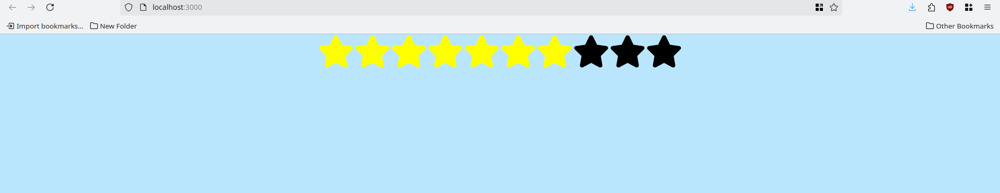
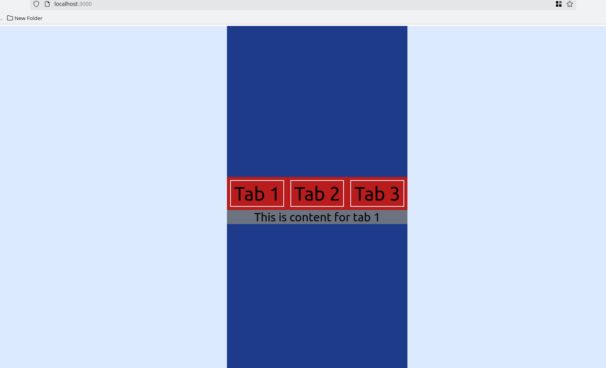

# Learning-react
A respository for tracking my journey of learning react

## List of Contents :
- [Tic-Tac-Toe](#tic-tac-toe)
- [TailWindCSS](#tailwindcss)
- [learning](#learning)
- [recoil-and-router-project](#recoil-and-router-project)
- [Business-cards](#business-cards)
- [Weather-App](#weather-app)
- [Recipe-App](#recipe-app)
- [Shopping-Cart](#shopping-cart)
---

### Tic-Tac-Toe

A simple Tic-Tac-Toe game, designed by me. help taken from [React](https://react.dev). Apart from basic Tic-Tac-Toe game, in it you can go to your previous moves also and make changes to your moves. Enjoy.

---
### TailWindCSS
Explore basic functionalitites and Setup in TailWindCSS. 

---
### learning
This project include various web components like :

- [Accordion](https://github.com/Sandstorm831/Learning-react/tree/main/learning/src/components/accordian) : Accordion components with a button to switch multiple selection and single selection optoins
  

- [Random Color Generator](https://github.com/Sandstorm831/Learning-react/tree/main/learning/src/components/random_color) : Random color generator, able to show color codes in both hex and RGB format
  

- [Star Rating](https://github.com/Sandstorm831/Learning-react/tree/main/learning/src/components/star_rating) : Star rating feature is implemented, which glows on hovering, and gets fixed on clicking
  

- [Image Slider](https://github.com/Sandstorm831/Learning-react/tree/main/learning/src/components/image_slider) : Image slider web component, fetching images from an external API
  

- [Load More Data](https://github.com/Sandstorm831/Learning-react/tree/main/learning/src/components/load-more-data) : Load more data functionality is implemented commonly seen on product-based websites to load more data components
  

- [Tree View](https://github.com/Sandstorm831/Learning-react/tree/main/learning/src/components/tree-view) : implementation of tree-structure webpage linkage functionality
  

- [QR Code Generator](https://github.com/Sandstorm831/Learning-react/tree/main/learning/src/components/qrcode) : This is an implementation of QR-Code generator made using [react-qr-code](https://www.npmjs.com/package/react-qr-code)
  

- [Light Dark Mode](https://github.com/Sandstorm831/Learning-react/tree/main/learning/src/components/light_dark_mode) : Implemented light dark mode switching functionality with custom react-hook
  

- [Custom Scroll Indicator](https://github.com/Sandstorm831/Learning-react/tree/main/learning/src/components/custom_scroll_indicator) : Custom scroll indicator, I thought it would be hard, but turned to be simple mathematics and a hook
  

- [Github profile finder](https://github.com/Sandstorm831/Learning-react/tree/main/learning/src/components/github_profile_finder) : Made a github profile finder, with simple imformation display
  

- [Custom Tabs](https://github.com/Sandstorm831/Learning-react/tree/main/learning/src/components/custom-tabs) : Implemented a custom tabs web-component, commonly it is used with links to specific pages which is just a simple add-on over "to" parameter.
  

- [Custom Modal Popup](https://github.com/Sandstorm831/Learning-react/tree/main/learning/src/components/custom_modal_popup) : Custom modal popups web component, used to appear for changing cookie settings, alerting, logging in and others
  

- [Search Auto-Complete](https://github.com/Sandstorm831/Learning-react/tree/main/learning/src/components/search-autocomplete) : Completed a search auto-complete functionality, where search is based upon a array of names
  

- [Feature Flag](https://github.com/Sandstorm831/Learning-react/tree/main/learning/src/components/feature-flag) : Made a easy to choose feature flag component, for those occasions when you have to display a component according to your choice for some time
  

- [UseFetch Custom Hook](https://github.com/Sandstorm831/Learning-react/tree/main/learning/src/components/useFetch) : This is a custom hook, used to fetch data from any given API and return data, loading and error state
  

- [ClickOutside](https://github.com/Sandstorm831/Learning-react/tree/main/learning/src/components/clickOutside) : Made the click outside functional web component, which closes the component automatically on clicking outside
  

- [Window Resize hook](https://github.com/Sandstorm831/Learning-react/tree/main/learning/src/components/useWindowResize) : Made a hook that gives the window size, height and width
  

- [Top-Bottom Scroller](https://github.com/Sandstorm831/Learning-react/tree/main/learning/src/components/ScrollTopBottom) : Web component that let you scroll to top or bottom of page with a click of a button, it was fun making, easy but fun
  

- [Section Scroller](https://github.com/Sandstorm831/Learning-react/tree/main/learning/src/components/ScrollSection) : final web component, section scroller, name justifies its purpose, but all of it was fun.
  

---
### Recoil and Router Project
[Recoil Project](https://github.com/Sandstorm831/Learning-react/tree/main/recoil_project) and [Router Project](https://github.com/Sandstorm831/Learning-react/tree/main/router_project) are two learning grade projects I made to make myself acquanted with Recoil library for state management and React-Router-DOM library for routing. Basic State management and Routing is performed to learn the basic-initial syntax of the libraries.

Recoil-project

Router-project

---
### Business-cards
[Business-cards](https://github.com/Sandstorm831/Learning-react/tree/main/businessCards) is a CSS intensive project, made to learn and demonstrate styling as a whole using TailWindCSS. An animation is embedded in each of the business card. On hovering on any of card, the title of card moves up, and a description about the card holder and it's social media handles appears in smooth transition, and disappears smoothly on hovering out. Everything is written in TailWindCSS. Apart from the animation, I have also put effort in understanding the positioning of element on the screen and after the hard day's work, I think, overall it looks and feels good.

---
### Weather-App
[Weather-App](https://github.com/Sandstorm831/Learning-react/tree/main/weather-app) is a simple web app which gives you weather of any city in the world. I have made this app very resilient, as it can not overwhealm the server by several identical API requests. In it I have implemented a debouncer, which debounces any API request that is made withing 250 milliseconds of the previous request, I have implemented an API aborter which aborts any API request that is not resolved untill now and a new API request is made. I have rendered the weather icons with the help of [weather-react-icons](https://github.com/taichi-t/weather-react-icons) library, they render weather icons with the weather codes and [Open Weather Map](https://www.openweathermap.org) API gives weather icon codes to render icons. Made a global loading state which shows a little gesture of [ loading . | loading .. | loading ... ] with time, it was fun to make as upto this point my code have gotten vast enough that I myself was forgetting what components does themselves. Also incorporated focus shifter click outside functionality which hides non essential things when clicked outside that component, It also has to be made global thus, I learnt createContext() and useContext() deeply through this. I have used TailWindCSS in it for styling, and it was quite comfortable to handle once you know the basic stuff and I have tried to make the UI somewhat lively and playfull with a somewhat easy-to-read stuff. I have learnt a lot of stuff through this project.

---
### Recipe-App
[Recipe-App](https://github.com/Sandstorm831/Learning-react/tree/main/recipie-app) is a web app (but not very simple) which gives recipes of various kind of dishes. You just have to input one of the ingredients of the recipe, and if the recipe shows up, you can click on *recipe details* button, through which you will land on the recipe details page. From there you can read the recipe and if you want to save the recipe, you can click the *Add to Favourites* button to add the recipe to favourites page. To view your saved favourites recipe, you just have to click on *Favourites* button in top-right corner to go to the favourites page. To create various pages, I have used react-router-dom library, and also used *useContext* extensively as most of my states are set to have global context. Designed all 4 pages with TailWindCSS. Used *useParams* hook to access id of the recipes in the global context and also taken *useNavigation* to automatically take user back and forth from different pages on certain functionalities.

---
### Shopping-Cart
[Shopping-Cart](https://github.com/Sandstorm831/Learning-react/tree/main/shopping_cart) is a normal shopping cart app, not very much different to above Recipe-App but in two ways. First, it displays consumer items and not recipes and second for state management it uses recoil instead of *Context*. Every other thing have done previously also, so nothing to illustrate in that.

Main *Home* Page

Loading interface

Cart Page

